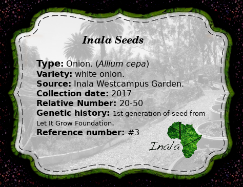

Seed Catalogue
==============
## #1
### Type
Spinach (_Spinacia oleracea_)

### Variety
Pale leaf
### Source
Let It Grow Foundation.
### Collection date
2015

Label

## #2

### Type
Pumkin (_Cucurbiter spp_)

### Variety
Masque De Provance
### Source
Let It Grow Foundation.
### collection date
unknown  
### Label

## #3

### Type
Onion (_Allium Cepa_)
### Variety
White onion
### Source
Inala (Westcampus) Food Garden
### collection date
2017
### Genetic Heritage
1st generation of seed provided by Let It Grow foundation. (Open pollinated)
### Label

