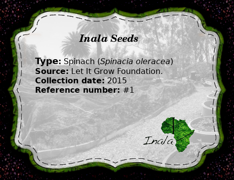
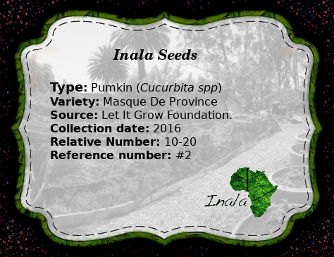

Seed Catalogue 
==============
## #1
### Type
Spinach (_Spinacia oleracea_)

### Variety
Pale leaf
### Source
Let It Grow Foundation.
### Collection date
2015

Label

## #2

### Type
Pumkin (_Cucurbiter spp_)

### Variety
Masque De Provance
### Source
Let It Grow Foundation.
 ### Label

###collection date
unknown  
